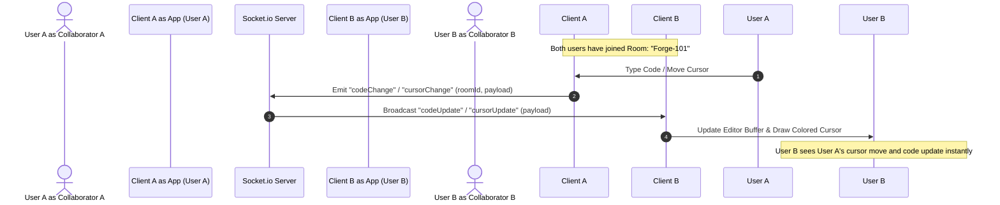

# SyncForge — Real-Time Collaborative Code Editor

A professional-grade, high-performance web platform that enables developers to write, edit, and coordinate code concurrently in real-time. Built with a modern glassmorphic user interface in deep navy and yellow accents, **SyncForge** provides a seamless collaborative environment with active cursor tracking, smart autocompletion, live typing indicators, and support for multiple programming languages.

---

## 📖 Dual-Perspective Overview

### 🏛️ Official & Formal Description
> **System Classification:** Distributed Real-Time Collaborative Text Editor
>
> SyncForge is a synchronized text-editing architecture implementing a bilateral event-driven WebSocket communication loop. The platform maintains socket-connected room isolation, routing cursor telemetry, language state, and text-buffer differentials between clients. Leveraging a lightweight, non-blocking asynchronous event model, the server propagates real-time cursor offsets, typing statuses, and content deltas with minimal latency, ensuring document consistency and mutual awareness across distributed sessions.

### 💡 Humanized & Simple Version (Plain English)
> **What it actually is:** A Google Docs-style code editor for you and your coding partners.
>
> Think of SyncForge as a virtual workspace where you and your friends can code together at the same time. You join a room, share the room code, and instantly see where everyone else is typing (their cursors show up in different colors with their names). You don't have to reload or wait to see changes—as they type, the code updates on your screen immediately. It also has a built-in typing indicator (so you know who is working) and auto-completes code as you type.

---

## 🛠️ The Tech Stack (One-by-One Details)

Every technology used in this project was selected to optimize performance, layout fluidity, and network synchronization. Below is an exhaustive breakdown of the technical components:

### 1. Frontend Engine

| Technology / Library | Formal Definition | Simple Version (What it does) |
| :--- | :--- | :--- |
| **React (v19)** | A declarative, component-based user interface library managing state-driven Virtual DOM rendering and optimization. | The core framework that builds the web pages, handles button clicks, and makes sure the UI updates when you join or leave a room. |
| **Vite (v8)** | A modern front-end build tool that utilizes native ES modules for fast Hot Module Replacement (HMR) and roll-up compilation. | The engine that starts the frontend development server instantly and bundles the files into a fast, optimized web app. |
| **Monaco Editor React (v4)** | A React wrapper for Microsoft's Monaco Editor, the browser-based code editor engine that powers VS Code. | The actual code editor box you type in. It gives you syntax highlighting, line numbers, and a professional coding interface. |
| **Socket.io Client (v4)** | An event-driven client library implementing WebSocket protocols with automatic HTTP fallback and reconnection management. | The client-side messenger that connects your browser to the backend server to send and receive real-time edits. |

### 2. Backend Server

| Technology / Library | Formal Definition | Simple Version (What it does) |
| :--- | :--- | :--- |
| **Node.js** | An asynchronous, event-driven JavaScript runtime environment designed for building scalable network applications. | The background engine that runs JavaScript on the computer instead of in the browser, serving as the foundation of the server. |
| **Express (v5)** | A minimalist web framework for Node.js that manages HTTP routing, middleware processing, and static file asset pipeline delivery. | The server software that listens for web requests and serves the website files (like index.html) to anyone who visits. |
| **Socket.io Server (v4)** | A real-time, bidirectional connection library providing WebSocket communication channels and namespace/room grouping logic. | The traffic controller on the server that receives code edits and sends them to everyone else in the same room. |
| **Nodemon (Dev Only)** | A utility that monitors directory source files and automatically restarts the Node application when changes are detected. | A developer tool that automatically restarts the backend server whenever a line of server code is modified. |

### 3. Design System & Aesthetics

| Technology / Library | Formal Definition | Simple Version (What it does) |
| :--- | :--- | :--- |
| **Vanilla CSS3** | Custom Cascading Style Sheet declarations leveraging CSS custom properties, flex/grid layouts, and cubic-bezier animations. | The styling language that colors the site. We avoided heavy CSS frameworks to keep styling clean, lightweight, and custom-tuned. |
| **Deep Navy & Yellow Theme** | A color scheme emphasizing readability in low-light environments, utilizing contrasting high-luminance active states. | A dark-blue and yellow palette that looks premium, modern, and reduces eye strain during long coding sessions. |
| **Glassmorphism** | A design trend utilizing backdrop-filter blurs, semi-transparent layers, and fine borders to simulate frosted glass. | Visual style using blurry glass backgrounds and glowing borders to give the interface a sleek, translucent, modern look. |

---

## 📐 System Architecture & Flow

The interaction loop between collaborators is shown in the sequence diagram below:



---

## 📂 Project Directory Structure

```
Real-Time Code Editor/
├── backend/
│   └── index.js             # Express & Socket.io server logic (room management, event relays)
├── frontend/
│   ├── dist/                # Production build output folder containing compiled assets
│   ├── public/              # Static public assets (icons, logo)
│   ├── src/
│   │   ├── App.css          # Core layouts, glassmorphic styles, custom scrollbars, animations
│   │   ├── App.jsx          # Primary UI container (room lobby, sidebar, Monaco integration, sockets)
│   │   ├── index.css        # Global CSS variables, reset, font imports, custom cursors style
│   │   └── main.jsx         # React application entry point (mounting App container)
│   ├── index.html           # HTML template for Vite
│   ├── package.json         # Frontend dependencies and run scripts
│   └── vite.config.js       # Vite bundler options and React plugin configurations
├── LICENSE                  # Mozilla Public License Version 2.0 (MPL-2.0)
├── package.json             # Root monorepo script executor and backend dependencies
└── README.md                # Project documentation (this file)
```

### 🔗 Quick File References
For quick navigation, you can access the primary source files directly:
* **Server Entry Point:** [backend/index.js](file:///d:/Real-Time%20Code%20Editor/backend/index.js)
* **Frontend Entry Point:** [frontend/src/main.jsx](file:///d:/Real-Time%20Code%20Editor/frontend/src/main.jsx)
* **React App Component:** [frontend/src/App.jsx](file:///d:/Real-Time%20Code%20Editor/frontend/src/App.jsx)
* **App Component Styles:** [frontend/src/App.css](file:///d:/Real-Time%20Code%20Editor/frontend/src/App.css)
* **Global CSS Variables & Animations:** [frontend/src/index.css](file:///d:/Real-Time%20Code%20Editor/frontend/src/index.css)
* **Vite Index Page:** [frontend/index.html](file:///d:/Real-Time%20Code%20Editor/frontend/index.html)
* **Root Package Config:** [package.json](file:///d:/Real-Time%20Code%20Editor/package.json)
* **Frontend Package Config:** [frontend/package.json](file:///d:/Real-Time%20Code%20Editor/frontend/package.json)

---

## ⚡ Key Features Exploded View

### 1. Collaborative Real-Time Editing
* **Formal:** Uses WebSockets to broadcast keystroke deltas to active rooms. Editor text buffer values are continuously synchronized across clients.
* **Simple:** As you type, the server instantly sends your changes to your teammates, updating their screens in real-time.

### 2. Multi-User Visual Cursor Tracking
* **Formal:** Propagates client cursor position coordinates (line number and column offset). Renders a floating, colored visual label overlay using Monaco's `deltaDecorations` API.
* **Simple:** You will see vertical colored bars moving around the screen representing your friends' cursors, labeled with their display names.

### 3. Custom Intelligent Autocompletion (LSP Snippets)
* **Formal:** Programmatically registers Monaco Completion Item Providers on component mount. Generates contextual keywords, built-ins, and boilerplate snippets for multiple languages (Python, C++, Java, C#, Go, Rust, HTML, CSS).
* **Simple:** Smart coding helpers. When you type in languages like Python or C++, the editor suggests words, variables, and common templates (like full loops or functions) to save you time.

### 4. Adaptive Room State & Dynamic Placeholders
* **Formal:** Automatically keeps track of client disconnects and room switches. Automatically matches default placeholder code comments to the active syntax mode (e.g., `#` for Python, `/*` for CSS).
* **Simple:** When you change the language, the welcome comment updates automatically. If a teammate loses connection, their cursor disappears immediately to keep the screen clean.

### 5. Instant Offline Download
* **Formal:** Generates client-side memory Blobs containing the active buffer text and triggers an anchor download sequence utilizing appropriate file extensions.
* **Simple:** A button that lets you instantly save your collaborative code as a file (.py, .cpp, .js, etc.) straight to your computer.

---

## 🚀 Execution & Setup Instructions

To run SyncForge on your local system, follow these deployment steps:

### 📋 Prerequisites
* **Node.js** (v18.0.0 or higher recommended)
* **NPM** (Node Package Manager)

### 📥 Step 1: Install Dependencies
Navigate to the root directory and install packages for both backend and frontend environments:
```bash
# This installs backend dependencies and automatically triggers installation inside the frontend directory
npm run build
```

### 💻 Step 2: Running the Application

#### A. Development Mode (With Hot Reloading)
Runs Nodemon on the backend (port `5000`) and allows you to run Vite on the frontend (port `5173`):
```bash
# In the root directory, starts the server with hot reloading
npm run dev

# (In a separate terminal) Start the frontend Vite dev server
cd frontend
npm run dev
```
Open [http://localhost:5173](http://localhost:5173) in your browser to view the application.

#### B. Production Mode (Single Port Serving)
Builds the frontend production bundles and serves static HTML files from the unified backend port (`5000`):
```bash
# Compile frontend code and start the Express server
npm run build
npm start
```
Open [http://localhost:5000](http://localhost:5000) in your browser.

---

## 📜 License & Compliance

This software is distributed under the **Mozilla Public License Version 2.0 (MPL-2.0)**. 
For more details, please review the full [LICENSE](file:///d:/Real-Time%20Code%20Editor/LICENSE) file in the root directory.
